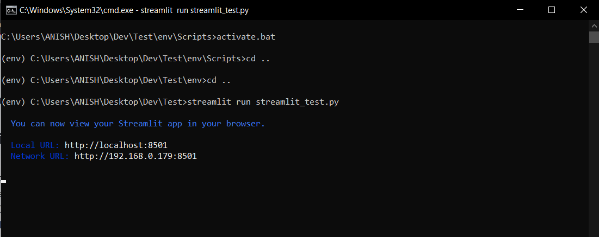
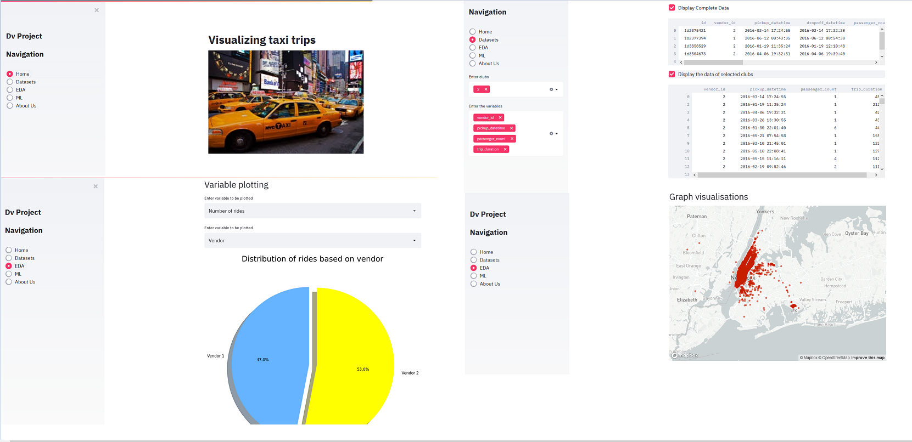

# Visualizations on taxi trip durations
The project aims to visualize the NYC Taxi Trip duration. Also dynamic predictions are made to user inputs basd on input variable used to train and deploy the models. 3-D interactive geo-spatial graphs are generated from with the use of pydeck ([Read more about Pydeck-streamlit API](https://docs.streamlit.io/library/api-reference/charts/st.pydeck_chart)).

# To run the streamlit app 
1. Install the virtual environment ```pip install virtualenv```
2. Start a Virtual Environment using the command ```virtualenv env```
3. Install all dependencies ```pip install requirements.txt```
4. Run the app by ```streamlit run streamlit_test.py```

<!--  --> 
# App preview



# Author
Anish S Ghiya (@anishsghiya)
